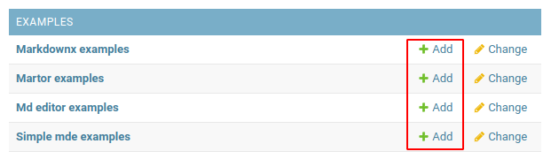

### Django markdown editors overview project

This project contains several implementation markdown libs for Django.

- [martor](https://github.com/agusmakmun/django-markdown-editor)
- [django-markdownx](https://github.com/neutronX/django-markdownx)
- [django-mdeditor](https://github.com/pylixm/django-mdeditor)
- [django-simplemde](https://github.com/onepill/django-simplemde) `(not has file uploading)`

You can find them in the django admin.

Change configs and experimental that choice what you better.

### Project ready to up with docker.

To run use `Makefile`:

```shell
make initialize
```

Or use `long way`:

```shell
cp .env.example .env # or copy manually .env.example to .env
docker-compose up --build -d
docker-compose exec app python manage.py makemigrations --noinput
docker-compose exec app python manage.py migrate --noinput
docker-compose exec app python manage.py createsuperuser --noinput &> /dev/null || true
```

After initialize, you can open django admin:
http://localhost:8080/admin

Press `Add` button on interesting your editor:



And you see selected markdown editor interface - `enjoy and experiment with configurations`

### Notes

- If you need get access for you uploaded files, your can open http://localhost:49001
  for access to `minio` with _username:_ `SomeKeyID` and _password:_ `SomeSecretKey`.
- I made some edits with upload methods, because it not work
  _from stock_ (from libs docs), you can see this changes in `src.config.uploader_views.py`
